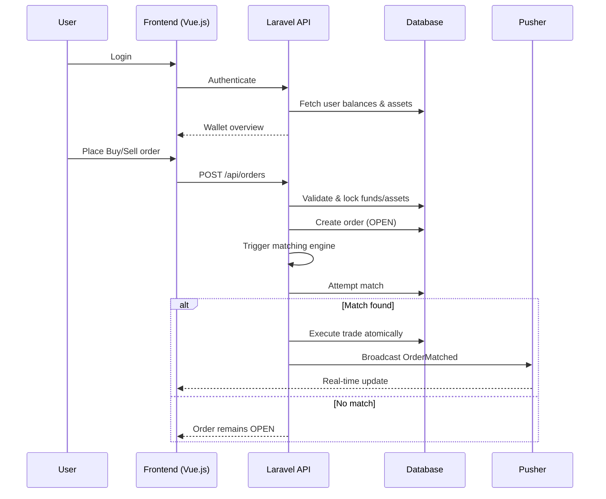
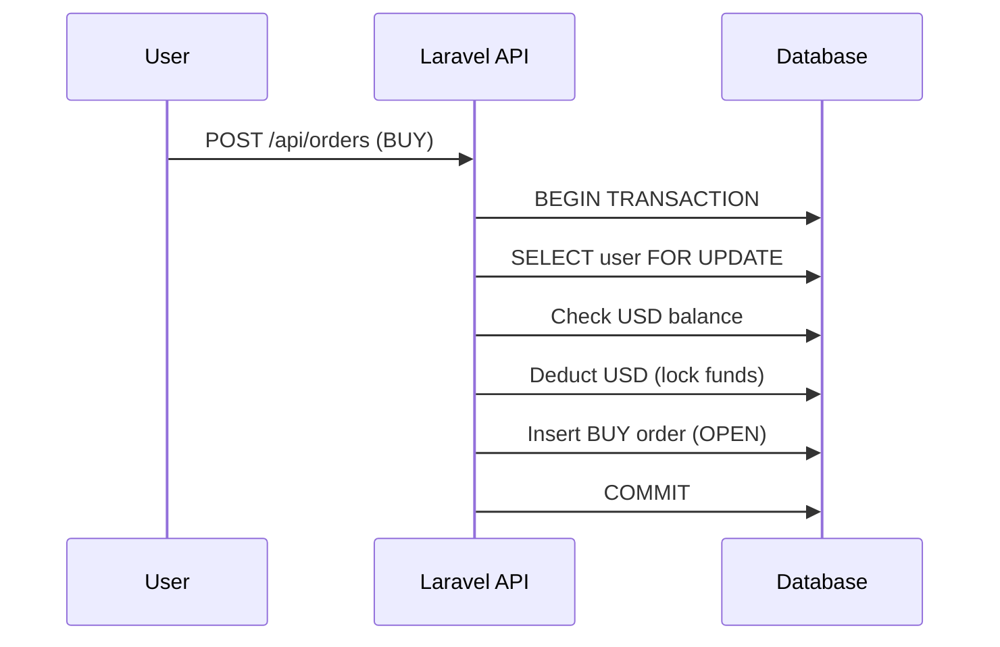
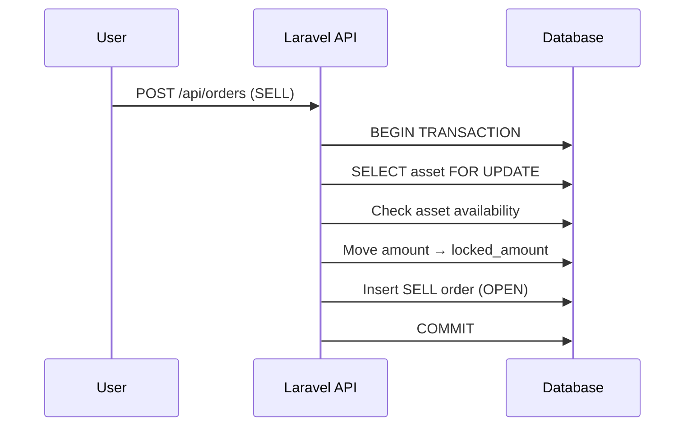
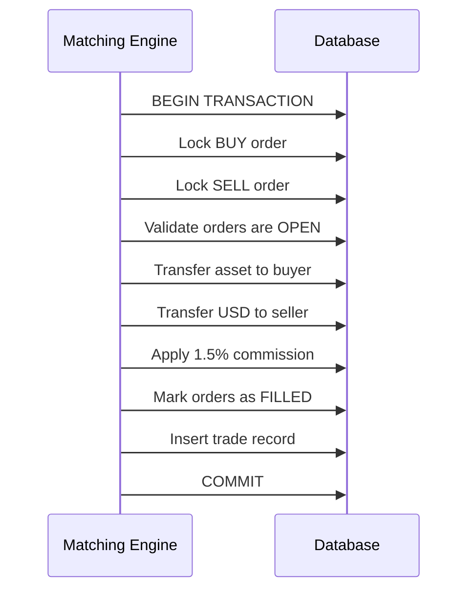
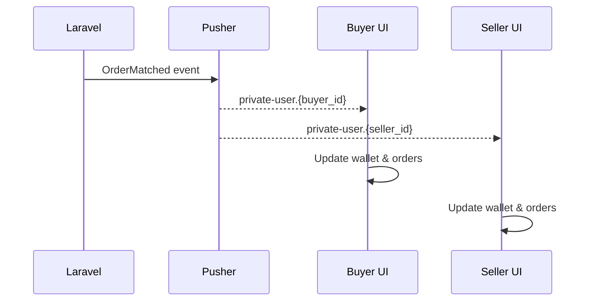

# Limit-Order Exchange – Mini Engine

A simplified **peer-to-peer limit-order exchange** built to demonstrate safe balance handling, atomic execution, and real-time synchronization.

The platform allows users to trade crypto assets (BTC, ETH) **with other users**, using limit orders.
The system never acts as a trading counterparty and does not provide liquidity.

## High-Level User & System Flow

## Buy Order Creation

## Sell Order Creation

## Order Matching (Full Match Only)

## Real-Time Notification Flow

## Trading Model Clarification

> Users trade directly with other users on the platform.
> The system acts only as a matching and settlement engine and never as a counterparty.

* Buy orders consume USD from buyers
* Sell orders consume assets from sellers
* Funds and assets are locked until execution or cancellation
