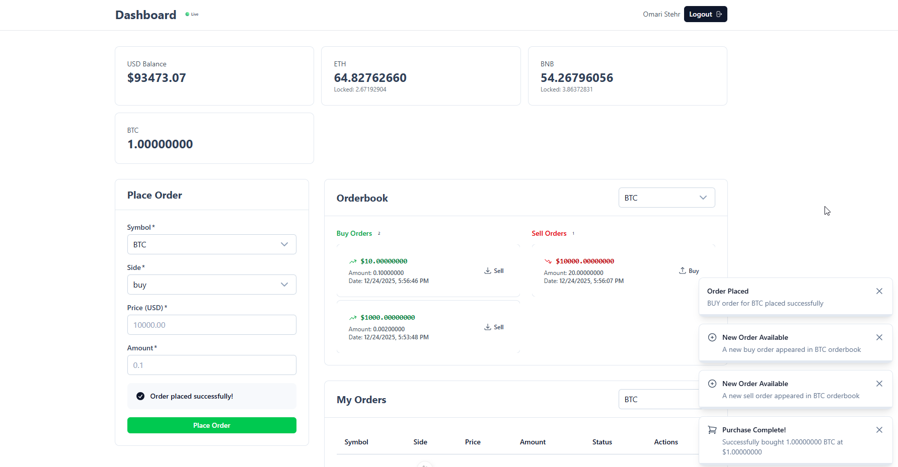

# Limit Order Exchange System

Real-time cryptocurrency exchange with automatic order matching. Built with Laravel 12 and Nuxt 3.



## Features

- **Trading**: Place buy/sell limit orders with automatic matching
- **Real-time Updates**: Live orderbook and instant notifications via Pusher
- **Commission**: 1.5% fee on all trades
- **Price Refunds**: Automatic refund when matched at better price
- **Modern UI**: Clean interface with Nuxt UI components

## Quick Start

### 1. Get Pusher Credentials

1. Create free account at [pusher.com](https://pusher.com)
2. Create new app, get: `app_id`, `key`, `secret`, `cluster`

### 2. Setup Backend

```bash
cd backend
composer install
cp .env.example .env

# Edit .env - add Pusher credentials:
BROADCAST_CONNECTION=pusher
QUEUE_CONNECTION=database
PUSHER_APP_ID=your_app_id
PUSHER_APP_KEY=your_key
PUSHER_APP_SECRET=your_secret
PUSHER_APP_CLUSTER=ap2

php artisan key:generate
php artisan migrate
php artisan db:seed  # Optional: test data
```

### 3. Setup Frontend

```bash
cd frontend
npm install

# Create .env:
echo "NUXT_BACKEND_URL=http://localhost:8000" > .env
echo "NUXT_PUSHER_KEY=your_key" >> .env
echo "NUXT_PUSHER_CLUSTER=ap2" >> .env
```

### 4. Run

**Terminal 1:**
```bash
cd backend && php artisan serve
```

**Terminal 2 (Required for matching):**
```bash
cd backend && php artisan queue:work
```

**Terminal 3:**
```bash
cd frontend && npm run dev
```

Open: http://localhost:3000

## Test

1. Register/Login
2. Place SELL order (0.1 BTC at $50000)
3. Open second browser window, login as different user
4. Place BUY order (0.1 BTC at $50000)
5. Orders match automatically, both users get notifications

## API Endpoints

```
POST /api/register
POST /api/login
GET  /api/profile
GET  /api/orders?symbol=BTC
POST /api/orders
POST /api/orders/{id}/cancel
GET  /api/trades
```

## Troubleshooting

**Orders not matching?**
- Check queue worker is running: `php artisan queue:work`

**No real-time updates?**
- Verify Pusher keys match in both `.env` files
- Check connection status badge (should be 🟢 Live)

**CORS errors?**
```bash
cd backend
php artisan config:clear
```

## Trading Rules

- **Full match only**: Amount must be exact
- **Commission**: 1.5% on all trades
- **No self-trading**: Can't match own orders
- **Price priority**: Best price first, then FIFO

---

**Built with Laravel 12 + Nuxt 3 + Pusher**
